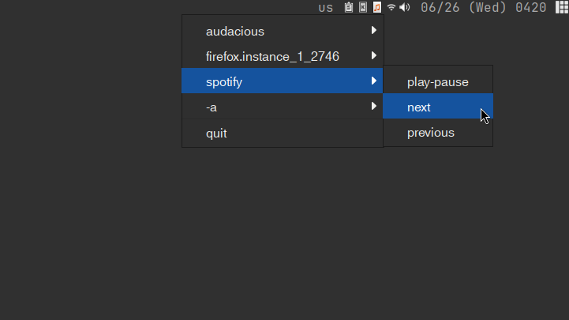

# playerctl_systray

This is just a simple and minimal system tray applet I created for my Linux setup while I was listening to music and working on a few side projects. I found myself getting annoyed by having to switch between workspaces/tags just to skip a track, so I decided to write a quick and janky Python applet. It saves me a few keystrokes and clicks in my everyday workflow. That’s really it 😅. 

I just wanted to share this in case anyone else wants to use it. It should work well with standalone window managers if you're looking for a simple applet to get up and running without the need to write a widget or panel block.



## Technical Information:

The application creates a system tray icon using the AppIndicator3 library, which is a part of the GTK project *(this should make it compatible with various Linux panels that support AppIndicators)*. It utilizes the `playerctl` command-line tool, making it work with most media players and web applications that supports MPRIS (Media Player Remote Interfacing Specification).

### Dependencies:
* `libappindicator`(-gtk3)
* `playerctl`

#### Information regarding the  `Makefile`
* I've also included a Makefile that utilizes `cython3` to create a `.c` file and then compile with `gcc` into a single binary.
* I can't really vouch for the continued reliability of the `Makefile` nor can I promise a significant performance increase with it being compiled as C code, but it's there if you want to give it a go 😌. 
* You will need to have `cython`, `gcc`, and `make` installed on your system to use the `Makefile`.

### Usage

```sh
$ python3 ./playerctl_systray.py
```

or simply…

```sh
$ ./playerctl_systray.py
```

#### How I Like to Run it On My Machines

As seen on my [dotfiles repo](https://github.com/kj-sh604/dotfiles), I wrap the usage of `playerctl_systray` in a script:

```sh
#!/bin/sh

BIN_PATH=~/.local/share/python-playerctl_systray/playerctl_systray
SCRIPT_PATH=~/.local/share/python-playerctl_systray/playerctl_systray.py

if ! command -v playerctl >/dev/null 2>&1; then
    echo "playerctl is not installed but is required."
    notify-send "dependency missing:" "playerctl is required to run playerctl_systray." --urgency critical
    exit 1
fi

if [ -f "$BIN_PATH" ]; then
    $BIN_PATH
elif [ -f "$SCRIPT_PATH" ]; then
    python3 $SCRIPT_PATH
else
    echo "playerctl_systray(.py) not found"
    notify-send "error!" "playerctl_systray(.py) not found" --urgency critical
fi
```

Feel free to write something similar.


## Other Implementations:
* xaymup's [media-control-indicator](https://github.com/xaymup/media-control-indicator) ✨
    * I've actually contributed to this repo in the past and I would say it's more "feature-complete" than my version. I actually highly recommend using it! *I just preferred a simpler and more barebones implementation that's why I kept my version*.

Happy hacking everyone! 🧑‍💻🤙
